<div align="center">
  

  # DJAlgoRhythm 🎵

  **🤖 The AI-Powered Chat-to-Spotify DJ Bot**

  *Turn your group chat into a collaborative music experience*

  [](https://golang.org/)
  [](LICENSE)
  [](https://telegram.org/)
  [](https://spotify.com/)

</div>

---

## ⚠️ **DISCLAIMER**

**This is a vibe-coded passion project!** 🚀

While DJAlgoRhythm works great for personal use and small groups, it was built with enthusiasm rather than enterprise-grade standards. **Not recommended for production environments** or critical applications. Use at your own risk and have fun with it!

---

## 🎯 **What is DJAlgoRhythm?**

DJAlgoRhythm transforms your group chat into an intelligent music curator. Simply drop a song name, artist, or Spotify link into your Telegram group, and watch as the bot automatically adds it to your shared Spotify playlist.

**✨ The magic happens when someone says:** *"Play some Arctic Monkeys"* and the AI figures out exactly which song they meant!

## ✨ **Features**

<table>
<tr>
<td width="50%">

### 🎵 **Smart Music Detection**
- **Spotify Links** → Instant playlist addition
- **YouTube/Apple Music** → AI-powered song matching
- **Free Text** → *"play some chill lofi beats"* → Perfect track selection

### 🤖 **AI-Powered Disambiguation**
- **OpenAI GPT** for intelligent song matching
- **Anthropic Claude** for nuanced understanding
- **Local Ollama** for privacy-focused setups
- **Fallback Mode** when AI isn't available

</td>
<td width="50%">

### 💬 **Multi-Platform Chat Support**
- **Telegram** → Primary platform with rich features
- **Interactive Group Selection** → No more manual setup headaches

### 🛡️ **Smart Safeguards**
- **Duplicate Prevention** → Bloom filters + LRU cache
- **User Confirmations** → 👍/👎 reactions or inline buttons
- **Admin Controls** → Approval workflows for organized groups
- **Flood Protection** → Anti-spam built-in

</td>
</tr>
</table>

### 🔧 **Developer-Friendly**
- **📊 Observability** → Prometheus metrics, health checks, structured logging
- **🐳 Containerized** → Docker support with docker-compose
- **⚡ Performance** → Efficient API usage with smart caching
- **🔄 Resilient** → Automatic retries, graceful shutdown, comprehensive error handling

## 🚀 **Quick Start**

> Get your group vibing in under 5 minutes!

### 📋 **Prerequisites**

| Requirement | Status | Notes |
|-------------|--------|-------|
| 🐹 **Go 1.24+** | ✅ Required | For building from source |
| 📱 **Telegram Bot** | ✅ Recommended | Create with [@BotFather](https://t.me/botfather) |
| 💚 **Spotify Premium** | ✅ Required | Free accounts can't control playback |
| 🤖 **AI Provider** | 🟡 Optional | OpenAI, Anthropic, or local Ollama |

### ⚡ **Installation**

<details>
<summary><strong>🎯 Option 1: Nix (Recommended for developers)</strong></summary>

```bash
# Clone the repository
git clone https://github.com/yourusername/djalgorhythm.git
cd djalgorhythm

# Enter the development environment
nix develop --impure

# Or with direnv for automatic environment switching
direnv allow
```

</details>

<details>
<summary><strong>🛠️ Option 2: Manual Go Setup</strong></summary>

```bash
# Ensure you have Go 1.24+ installed
git clone https://github.com/yourusername/djalgorhythm.git
cd djalgorhythm
go mod download
```

</details>

<details>
<summary><strong>🐳 Option 3: Docker (Coming Soon)</strong></summary>

```bash
# Build and run with Docker
docker build -t djalgorhythm .
docker run --env-file .env -p 8080:8080 djalgorhythm
```

</details>

### ⚙️ **Configuration**

> **The fun part! Let's connect everything together** 🔗

#### **Step 1: Environment Setup**
```bash
cp .env.example .env
```

#### **Step 2: Spotify Setup** 🎵
<details>
<summary>Click to expand Spotify configuration</summary>

1. Go to [Spotify Developer Dashboard](https://developer.spotify.com/dashboard)
2. Create a new app named "DJAlgoRhythm"
3. Add redirect URI: `http://127.0.0.1:8080/callback`
4. Copy your Client ID and Secret to `.env`:

```bash
DJALGORHYTHM_SPOTIFY_CLIENT_ID=your_client_id_here
DJALGORHYTHM_SPOTIFY_CLIENT_SECRET=your_client_secret_here
DJALGORHYTHM_SPOTIFY_PLAYLIST_ID=your_playlist_id_here  # From Spotify URL
```

</details>

#### **Step 3: Telegram Setup** 📱
<details>
<summary>Click to expand Telegram configuration</summary>

1. **Create Bot**: Message [@BotFather](https://t.me/botfather) → `/newbot`
2. **Add to Group**: Invite your new bot to your music group
3. **Make Admin**: Give the bot admin permissions (required for reading messages)
4. **Configure**: Add bot token to `.env`:

```bash
DJALGORHYTHM_TELEGRAM_ENABLED=true
DJALGORHYTHM_TELEGRAM_BOT_TOKEN=123456:ABC-DEF1234ghIkl-zyx57W2v1u123ew11
# Group ID will be auto-detected on first run! 🚀
```

</details>

#### **Step 4: AI Setup (Optional but Recommended)** 🤖
<details>
<summary>Click to expand AI provider configuration</summary>

Choose your AI provider for smart song disambiguation:

**OpenAI (Recommended)**
```bash
DJALGORHYTHM_LLM_PROVIDER=openai
DJALGORHYTHM_LLM_API_KEY=sk-...
DJALGORHYTHM_LLM_MODEL=gpt-4o-mini  # Cost-effective choice
```

**Anthropic Claude**
```bash
DJALGORHYTHM_LLM_PROVIDER=anthropic
DJALGORHYTHM_LLM_API_KEY=sk-ant-...
DJALGORHYTHM_LLM_MODEL=claude-3-haiku-20240307  # Fast & cheap
```

**Local Ollama (Privacy-focused)**
```bash
DJALGORHYTHM_LLM_PROVIDER=ollama
DJALGORHYTHM_LLM_BASE_URL=http://localhost:11434
DJALGORHYTHM_LLM_MODEL=llama3.2  # Install with: ollama pull llama3.2
```

</details>

4. **Configure LLM (Optional):**

   ```bash
   # For OpenAI
   DJALGORHYTHM_LLM_PROVIDER=openai
   DJALGORHYTHM_LLM_API_KEY=sk-...

   # For Anthropic
   DJALGORHYTHM_LLM_PROVIDER=anthropic
   DJALGORHYTHM_LLM_API_KEY=sk-ant-...

   # For local Ollama
   DJALGORHYTHM_LLM_PROVIDER=ollama
   DJALGORHYTHM_LLM_BASE_URL=http://localhost:11434
   ```

### 🎬 **Running DJAlgoRhythm**

**Option 1: Quick Start**
```bash
# Build and run (recommended)
make build
./bin/djalgorhythm
```

**Option 2: Development Mode**
```bash
# Run directly from source
go run ./cmd/djalgorhythm
```

**Option 3: Advanced Configuration**
```bash
# Custom config and debug logging
./bin/djalgorhythm --config myconfig.env --log-level debug
```

🎉 **First Run**: The app will automatically scan for Telegram groups and let you pick one!

---

## Chat Platform Setup

### Telegram Setup (Recommended)

1. **Create Bot:**
   - Message [@BotFather](https://t.me/botfather)
   - Use `/newbot` and follow instructions
   - Copy the bot token

2. **Setup Group:**
   - Create a group or use existing one
   - Add your bot to the group
   - Make the bot an admin (required for message access)

3. **Get Group ID:**
   - **Automatic Detection** (Recommended): Leave `DJALGORHYTHM_TELEGRAM_GROUP_ID` unset in your `.env` file
   - The application will scan for available groups and let you select one interactively on first startup
   - **Manual Setup**: If you know your group ID, set it directly in `.env`

4. **Configure Bot:**
   - Enable inline mode (optional): `/setinline` with @BotFather
   - Set commands (optional): `/setcommands` with @BotFather


## 🎼 **How to Use DJAlgoRhythm**

> Just drop music into your group chat and watch the magic happen! ✨

### 🎯 **Message Types**

<div align="center">

| Type | Example | What Happens |
|------|---------|--------------|
| **🔗 Spotify Link** | `https://open.spotify.com/track/4uLU6hMCjMI75M1A2tKUQC` | ⚡ **Instant add** (if not duplicate) |
| **🎥 YouTube/Apple Music** | `https://www.youtube.com/watch?v=dQw4w9WgXcQ` | 🤔 **"Which song do you mean?"** |
| **💬 Natural Language** | `"play some chill arctic monkeys"` | 🤖 **AI figures it out** → 👍 confirm |

</div>

### 💡 **Real Examples**

**Spotify Links** → Instant gratification
```
User: https://spotify.link/ie2dPfjkzXb
Bot: ✅ Added: Daft Punk - One More Time
```

**Casual Requests** → AI-powered magic
```
User: "Something upbeat by Taylor Swift"
Bot: 🎵 Did you mean Taylor Swift - Anti-Hero (2022)?
     React 👍 to add or 👎 to skip
```

**YouTube/Apple Music** → Smart conversion
```
User: https://www.youtube.com/watch?v=dQw4w9WgXcQ
Bot: 🤔 I found a YouTube link! Which track do you want from it?
```

### 🎮 **How Users Interact**

<table>
<tr>
<td width="50%">

**📱 Telegram Features**
- 🔘 **Inline Buttons** → "👍 Confirm" or "👎 Not this"
- 😊 **Emoji Reactions** → React with 👍/👎 on messages
- 👑 **Admin Controls** → Optional approval workflows

</td>
<td width="50%">


</td>
</tr>
</table>

### 🔄 **The DJAlgoRhythm Flow**

```mermaid
graph TD
    A["💬 User sends message"] --> B{"🤔 What type?"}
    B -->|"🔗 Spotify Link"| C["⚡ Instant add to playlist"]
    B -->|"🎥 YouTube/Apple"| D["🤖 AI: Which song?"]
    B -->|"💭 Free text"| E["🤖 AI finds best match"]

    D --> F["👍 User confirms"] --> C
    E --> G{"🎯 AI confidence"}
    G -->|"High"| H["👍 Auto-confirm"] --> C
    G -->|"Low"| I["❓ Ask for confirmation"] --> F

    C --> J["🎵 Added to Spotify!"]

    style C fill:#1DB954
    style J fill:#1DB954
    style A fill:#26A5E4
```



## Configuration

### Environment Variables

| Variable | Description | Default | Required |
|----------|-------------|---------|----------|
| **Chat Platforms** | | | |
| `DJALGORHYTHM_TELEGRAM_ENABLED` | Enable Telegram integration | `true` | ❌ |
| `DJALGORHYTHM_TELEGRAM_BOT_TOKEN` | Telegram bot token | - | ✅ (if enabled) |
| `DJALGORHYTHM_TELEGRAM_GROUP_ID` | Telegram group ID (auto-detected if unset) | - | ❌ |
| `DJALGORHYTHM_ADMIN_APPROVAL` | Require admin approval for songs | `false` | ❌ |
| `DJALGORHYTHM_ADMIN_NEEDS_APPROVAL` | Require approval even for admins (testing) | `false` | ❌ |
| **Spotify** | | | |
| `DJALGORHYTHM_SPOTIFY_CLIENT_ID` | Spotify app client ID | - | ✅ |
| `DJALGORHYTHM_SPOTIFY_CLIENT_SECRET` | Spotify app secret | - | ✅ |
| `DJALGORHYTHM_SPOTIFY_PLAYLIST_ID` | Target playlist ID | - | ✅ |
| **LLM** | | | |
| `DJALGORHYTHM_LLM_PROVIDER` | AI provider (openai/anthropic/ollama/none) | `none` | ❌ |
| `DJALGORHYTHM_LLM_API_KEY` | LLM API key | - | ❌ |
| `DJALGORHYTHM_LLM_MODEL` | Model name | Provider default | ❌ |
| **General** | | | |
| `DJALGORHYTHM_CONFIRM_TIMEOUT_SECS` | Reaction timeout (seconds) | `120` | ❌ |
| `DJALGORHYTHM_CONFIRM_ADMIN_TIMEOUT_SECS` | Reaction timeout for admins (seconds) | `3600` | ❌ |
| `DJALGORHYTHM_QUEUE_AHEAD_DURATION_SECS` | Target queue duration (seconds) | `90` | ❌ |
| `DJALGORHYTHM_QUEUE_CHECK_INTERVAL_SECS` | Queue check interval (seconds) | `45` | ❌ |
| `DJALGORHYTHM_SERVER_PORT` | HTTP server port | `8080` | ❌ |
| `DJALGORHYTHM_LOG_LEVEL` | Logging level | `info` | ❌ |

### CLI Flags

```bash
djalgorhythm --help

Flags:
      --config string                  config file (default is .env)
      --log-level string              log level (debug, info, warn, error) (default "info")
      --telegram-enabled              enable Telegram integration (default true)
      --telegram-bot-token string     Telegram bot token
      --telegram-group-id int         Telegram group ID
      --spotify-client-id string      Spotify client ID
      --spotify-playlist-id string    Spotify playlist ID
      --llm-provider string           LLM provider (openai, anthropic, ollama, none) (default "none")
      --server-port int               HTTP server port (default 8080)
      --confirm-timeout int           Confirmation timeout in seconds (default 120)
```

### Example .env File

```bash
# Chat Platform (choose one)
DJALGORHYTHM_TELEGRAM_ENABLED=true
DJALGORHYTHM_TELEGRAM_BOT_TOKEN=123456:ABC-DEF1234ghIkl-zyx57W2v1u123ew11
# DJALGORHYTHM_TELEGRAM_GROUP_ID=-100xxxxxxxxxx  # Auto-detected on first run


# Spotify (required)
DJALGORHYTHM_SPOTIFY_CLIENT_ID=your_spotify_client_id
DJALGORHYTHM_SPOTIFY_CLIENT_SECRET=your_spotify_client_secret
DJALGORHYTHM_SPOTIFY_PLAYLIST_ID=37i9dQZF1DX0XUsuxWHRQd

# LLM (optional)
DJALGORHYTHM_LLM_PROVIDER=openai
DJALGORHYTHM_LLM_API_KEY=sk-...
DJALGORHYTHM_LLM_MODEL=gpt-4o-mini

# General
DJALGORHYTHM_CONFIRM_TIMEOUT_SECS=120
DJALGORHYTHM_SERVER_PORT=8080
DJALGORHYTHM_LOG_LEVEL=info
```

## Development

### Project Structure

```
cmd/djalgorhythm/           # Main application
internal/
  ├── chat/           # Unified chat frontend interface
  │   ├── telegram/   # Telegram Bot API client
  ├── core/           # Domain types and message dispatcher
  ├── spotify/        # Spotify client (zmb3/spotify)
  ├── llm/            # LLM providers (OpenAI, Anthropic, Ollama)
  ├── store/          # Dedup store (Bloom + LRU)
  └── http/           # HTTP server and metrics
pkg/
  ├── text/           # Message parsing and URL detection
  └── fuzzy/          # String similarity and normalization
```

### Development Environment

The project uses **devenv** (Nix) for reproducible development:

```bash
# Enter development shell
nix develop --impure

# Available tools
devenv-help

# VS Code with extensions
code .
```

Included tools:

- Go toolchain with delve debugger
- golangci-lint for linting
- Git LFS for large files
- Claude Code extension for AI assistance

### Building

```bash
# Build binary
make build

# Run tests
make test

# Run linting
make lint

# Clean build artifacts
make clean
```

### Testing

```bash
# Run all tests
go test ./...

# Run tests with coverage
go test -cover ./...

# Run tests with race detection
go test -race ./...

# Test specific package
go test ./internal/chat/telegram/
```

## API Endpoints

| Endpoint | Description |
|----------|-------------|
| `GET /` | Service information and status |
| `GET /healthz` | Health check (liveness probe) |
| `GET /readyz` | Readiness check |
| `GET /metrics` | Prometheus metrics |

### Metrics

Key metrics exposed at `/metrics`:

- `djalgorhythm_messages_total` - Messages processed by type/status
- `djalgorhythm_adds_total` - Tracks added by source
- `djalgorhythm_duplicates_total` - Duplicate tracks rejected
- `djalgorhythm_llm_calls_total` - LLM API calls by provider/status
- `djalgorhythm_errors_total` - Errors by component/type
- `djalgorhythm_processing_duration_seconds` - Processing time histogram
- `djalgorhythm_playlist_size` - Current playlist track count
- `djalgorhythm_active_sessions` - Active message processing sessions

## Deployment

### Docker

```bash
# Build image
docker build -t djalgorhythm:latest .

# Run with environment file
docker run --env-file .env -p 8080:8080 djalgorhythm:latest

# Or with docker-compose
docker-compose up -d
```

### Production Considerations

- **Secrets**: Use proper secret management (not .env files)
- **Monitoring**: Set up Prometheus + Grafana dashboards
- **Logs**: Forward structured logs to your logging system
- **Backup**: Chat frontend sessions and Spotify tokens
- **Scaling**: Single instance recommended (chat sessions are stateful)
- **Compliance**: Be aware of chat platform ToS

## Troubleshooting

### Common Issues

**Telegram Bot Setup:**

```bash
# Check bot token is valid
curl "https://api.telegram.org/bot<TOKEN>/getMe"

# Verify bot is admin in group
# Check group ID is correct (negative number)
```


**Spotify Authentication:**

```bash
# Verify redirect URI matches Spotify app settings
# Check client ID and secret are correct
# Ensure playlist ID is valid and accessible
```

**LLM Errors:**

```bash
# Check API key is valid
# Verify model name is correct
# Monitor rate limits in logs
```

### Debug Mode

```bash
# Enable debug logging
DJALGORHYTHM_LOG_LEVEL=debug ./bin/djalgorhythm

# Or with flag
./bin/djalgorhythm --log-level debug
```

## Contributing

1. **Fork** the repository
2. **Create** a feature branch (`git checkout -b feature/amazing-feature`)
3. **Commit** your changes (`git commit -m 'Add amazing feature'`)
4. **Push** to the branch (`git push origin feature/amazing-feature`)
5. **Open** a Pull Request

### Development Guidelines

- Follow Go conventions and idioms
- Add tests for new functionality
- Update documentation for user-facing changes
- Run `make lint` before committing
- Use conventional commit messages

## License

This project is licensed under the MIT License - see the [LICENSE](LICENSE) file for details.

## 🙏 **Acknowledgments**

DJAlgoRhythm stands on the shoulders of giants:

- 🤖 **[go-telegram/bot](https://github.com/go-telegram/bot)** - Telegram Bot API client
- 🎵 **[zmb3/spotify](https://github.com/zmb3/spotify)** - Spotify Web API wrapper
- 🧠 **[OpenAI](https://openai.com/) / [Anthropic](https://anthropic.com/)** - AI disambiguation power
- 📊 **[Prometheus](https://prometheus.io/)** - Monitoring and alerting

---

<div align="center">

**Made with ❤️ and 🎵 by the DJAlgoRhythm community**

*Keep the music alive!* 🎸

[](https://github.com/yourusername/djalgorhythm)
[](https://github.com/yourusername)

</div>
