# DJAlgoRhythm 🎵

<div align="center">
  

## 🤖 The AI-Powered Chat-to-Spotify DJ Bot

Turn your group chat into a collaborative music experience

  [](https://golang.org/)
  [](LICENSE)
  [](https://telegram.org/)
  [](https://spotify.com/)

</div>

---

## ⚠️ **DISCLAIMER**

**This is a vibe-coded passion project!** 🚀

While DJAlgoRhythm works great for personal use and small groups, it was built with enthusiasm rather than
enterprise-grade standards. **Not recommended for production environments** or critical applications. Use at your
own risk and have fun with it!

---

## 🎯 **What is DJAlgoRhythm?**

DJAlgoRhythm transforms your group chat into an intelligent music curator. Simply drop a song name, artist, Spotify link,
or even cross-platform music links (YouTube, Apple Music, Tidal, etc.) into your Telegram group, and watch as the bot
automatically adds it to your shared Spotify playlist.

**✨ The magic happens when someone says:** *"Play some Arctic Monkeys"* and the AI figures out exactly which song they meant!

## ✨ **Features**

<table>
<tr>
<td width="50%">

### 🎵 **Smart Music Detection**

- **Spotify Links** → Instant playlist addition
- **Cross-Platform Links** → Smart matching with confirmation (YouTube, Apple Music, Tidal, Beatport, Amazon Music, SoundCloud)
- **Free Text** → *"play some chill lofi beats"* → Perfect track selection

### 🤖 **AI-Powered Disambiguation**

- **OpenAI GPT** for intelligent song matching (fully implemented)
- **Anthropic Claude** (interface only - not yet implemented)
- **Local Ollama** (interface only - not yet implemented)

</td>
<td width="50%">

### 💬 **Multi-Platform Chat Support**

- **Telegram** → Primary platform with rich features
- **Interactive Group Selection** → No more manual setup headaches

### 🛡️ **Smart Safeguards**

- **Duplicate Prevention** → Bloom filters + LRU cache
- **User Confirmations** → 👍/👎 reactions or inline buttons
- **Admin Controls** → Approval workflows for organized groups
- **Flood Protection** → Anti-spam built-in

</td>
</tr>
</table>

### 🔧 **Developer-Friendly**

- **📊 Observability** → Prometheus metrics, health checks, structured logging
- **🐳 Containerized** → Docker support
- **⚡ Performance** → Efficient API usage with smart caching
- **🔄 Resilient** → Automatic retries, graceful shutdown, comprehensive error handling

## 🚀 **Quick Start**

> Get your group vibing in under 5 minutes!

### 📋 **Prerequisites**

| Requirement | Status | Notes |
|-------------|--------|-------|
| 🐹 **Go 1.25+** | ✅ Required | For building from source |
| 📱 **Telegram Bot** | ✅ Required | Create with [@BotFather](https://t.me/botfather) |
| 💚 **Spotify Premium** | ✅ Required | Free accounts can't control playback |
| 🤖 **AI Provider** | ✅ Required | OpenAI GPT (fully supported), Anthropic and Ollama (stubs only) |

### ⚡ **Installation**

<details>
<summary><strong>🎯 Option 1: devenv (Recommended for developers)</strong></summary>

```bash
# First, install devenv if you haven't already
# See: https://devenv.sh/getting-started/

# Clone the repository
git clone https://github.com/Enteee/DJAlgoRhythm.git
cd DJAlgoRhythm

# Enter the development environment
devenv shell

# Or with direnv for automatic environment switching
direnv allow
```

</details>

<details>
<summary><strong>🛠️ Option 2: Manual Go Setup</strong></summary>

```bash
# Ensure you have Go 1.25+ installed
git clone https://github.com/Enteee/DJAlgoRhythm.git
cd DJAlgoRhythm
go mod download
```

</details>

<details>
<summary><strong>🐳 Option 3: Docker</strong></summary>

```bash
# Option A: Docker Hub (recommended)
docker run --env-file .env -p 8080:8080 enteee/djalgorhythm:latest

# Option B: GitHub Container Registry
docker run --env-file .env -p 8080:8080 ghcr.io/enteee/djalgorhythm:latest
```

</details>

### ⚙️ **Configuration**

> **The fun part! Let's connect everything together** 🔗

#### **Step 1: Environment Setup**

```bash
cp .env.example .env
```

Now edit `.env` with your credentials (see steps below).

#### **Step 2: Spotify Setup** 🎵

<details>
<summary>Click to expand Spotify configuration</summary>

1. Go to [Spotify Developer Dashboard](https://developer.spotify.com/dashboard)
2. Create a new app named "DJAlgoRhythm"
3. **Enable required APIs** (check both boxes):
   - ✅ **Web API**
   - ✅ **Web Playback SDK**
4. Add redirect URI: `http://127.0.0.1:8080/callback`
5. Copy your Client ID and Secret

6. **Create a Spotify Playlist**:
   - Open Spotify and create a new playlist (e.g., "Group DJ Queue")
   - Right-click the playlist → Share → Copy link to playlist
   - Extract the Playlist ID from the URL:
     - URL format: `https://open.spotify.com/playlist/37i9dQZF1DXcBWIGoYBM5M`
     - Playlist ID: `37i9dQZF1DXcBWIGoYBM5M` (everything after `/playlist/`)

7. Add all credentials to `.env`:

```bash
DJALGORHYTHM_SPOTIFY_CLIENT_ID=your_client_id_here
DJALGORHYTHM_SPOTIFY_CLIENT_SECRET=your_client_secret_here
DJALGORHYTHM_SPOTIFY_PLAYLIST_ID=37i9dQZF1DXcBWIGoYBM5M  # Your playlist ID from step 6
```

</details>

#### **Step 3: Telegram Setup** 📱

<details>
<summary>Click to expand Telegram configuration</summary>

1. **Create Bot**: Message [@BotFather](https://t.me/botfather) → `/newbot`
2. **Add to Group**: Invite your new bot to your music group
3. **Make Admin**: Give the bot admin permissions (required for reading messages)
4. **Configure**: Add bot token to `.env`:

```bash
DJALGORHYTHM_TELEGRAM_ENABLED=true
DJALGORHYTHM_TELEGRAM_BOT_TOKEN=123456:ABC-DEF1234ghIkl-zyx57W2v1u123ew11
# Group ID will be auto-detected on first run! 🚀
```

</details>

#### **Step 4: AI Setup (Required)** 🤖

<details>
<summary>Click to expand AI provider configuration</summary>

Choose your AI provider for smart song disambiguation:

##### OpenAI (Recommended - Fully Supported)

```bash
DJALGORHYTHM_LLM_PROVIDER=openai
DJALGORHYTHM_LLM_API_KEY=sk-...
DJALGORHYTHM_LLM_MODEL=gpt-4o-mini  # Cost-effective choice
```

##### Anthropic Claude (Not Yet Implemented)

**Note:** Anthropic provider is currently only a stub interface. Implementation coming soon!

```bash
# NOT CURRENTLY WORKING - Interface only
DJALGORHYTHM_LLM_PROVIDER=anthropic
DJALGORHYTHM_LLM_API_KEY=sk-ant-...
DJALGORHYTHM_LLM_MODEL=claude-3-haiku-20240307  # Fast & cheap
```

##### Local Ollama (Not Yet Implemented)

**Note:** Ollama provider is currently only a stub interface. Implementation coming soon!

```bash
# NOT CURRENTLY WORKING - Interface only
DJALGORHYTHM_LLM_PROVIDER=ollama
DJALGORHYTHM_LLM_BASE_URL=http://localhost:11434
DJALGORHYTHM_LLM_MODEL=llama3.2  # Install with: ollama pull llama3.2
```

</details>

### 🎬 **Running DJAlgoRhythm**

#### Option 1: Quick Start

```bash
# Build and run (recommended)
make build
./bin/djalgorhythm
```

#### Option 2: Development Mode

```bash
# Run directly from source
go run ./cmd/djalgorhythm
```

#### Option 3: Advanced Configuration

```bash
# Custom config and debug logging
./bin/djalgorhythm --config myconfig.env --log-level debug
```

#### 🔐 **First Run: Spotify Authorization**

On first startup, DJAlgoRhythm will guide you through Spotify OAuth:

1. The terminal will display an authorization URL
2. Open the URL in your browser
3. Log in to Spotify and click "Agree"
4. Your browser will redirect to `127.0.0.1:8080/callback` with a success message
5. DJAlgoRhythm automatically receives the authorization and continues startup

**No manual code copy-paste needed!** The OAuth flow is fully automated with a temporary callback server.

🎉 **Additional Setup**: The app will automatically scan for Telegram groups and let you pick one!

---

## 🎼 **How to Use DJAlgoRhythm**

> Just drop music into your group chat and watch the magic happen! ✨

### 🎯 **Message Types**

<div align="center">

| Type | Example | What Happens |
|------|---------|--------------|
| **🔗 Spotify Link** | `https://open.spotify.com/track/4uLU6hMCjMI75M1A2tKUQC` | ⚡ **Instant add** (if not duplicate) |
| **🎥 Cross-Platform Link** | `https://www.youtube.com/watch?v=dQw4w9WgXcQ` | 🔍 **Resolves → Shows match** → 👍 confirm |
| **💬 Natural Language** | `"play some chill arctic monkeys"` | 🤖 **AI figures it out** → 👍 confirm |

</div>

> **Supported Music Platforms:** YouTube, YouTube Music, Apple Music, Tidal, Beatport, Amazon Music, SoundCloud
>
> **Technical Details:**
>
> - **API-Based Providers** (reliable, fast): YouTube (oEmbed), SoundCloud (oEmbed),
>   Apple Music (iTunes Lookup API with ISRC support)
> - **HTML Scraping Providers** (may break if provider changes page structure):
>   Tidal, Beatport, Amazon Music
> - All providers include graceful fallback to AI disambiguation on failure

### 💡 **Real Examples**

#### Spotify Links → Instant gratification

```text
User: https://open.spotify.com/track/0DiWol3AO6WpXZgp0goxAV
Bot: ✅ Added: Daft Punk - One More Time
```

#### Casual Requests → AI-powered magic

```text
User: "Something upbeat by Taylor Swift"
Bot: 🎵 Did you mean Taylor Swift - Anti-Hero (2022)?
     React 👍 to add or 👎 to skip
```

#### Cross-Platform Links → Smart Matching

```text
User: https://www.youtube.com/watch?v=dQw4w9WgXcQ
Bot: 🎵 Found: Rick Astley - Never Gonna Give You Up (1987)
     React 👍 to add or 👎 to skip

User: https://www.beatport.com/track/love-songs-feat-kosmo-kint/21977538
Bot: 🎵 Found: Prospa, Kosmo Kint - Love Songs (feat. Kosmo Kint) (Extended Mix)
     React 👍 to add or 👎 to skip

User: https://soundcloud.com/rick-astley-official/never-gonna-give-you-up-4
Bot: 🎵 Found: Rick Astley - Never Gonna Give You Up
     React 👍 to add or 👎 to skip
```

### 🎮 **How Users Interact**

#### 📱 Telegram Features

- 🔘 **Inline Buttons** → "👍 Confirm" or "👎 Not this"
- 😊 **Emoji Reactions** → React with 👍/👎 on messages
- 👑 **Admin Controls** → Optional approval workflows

### 🔄 **The DJAlgoRhythm Flow**

```mermaid
graph TD
    A["💬 User sends message"] --> B{"🤔 What type?"}
    B -->|"🔗 Spotify Link"| C1["🔍 Check for duplicates"]
    B -->|"🎥 Cross-Platform Link"| C3["🔍 Resolve & match to Spotify"]
    B -->|"💭 Free text"| E["🤖 4-stage LLM disambiguation"]

    C3 -->|"Success"| CONFIRM["👍 User confirms track?"]
    C3 -->|"Failed"| D["💬 Ask: Which song?"]

    C1 -->|"New track"| C2{"🛡️ Admin approval required?"}
    C1 -->|"Duplicate"| REJECT_DUP["❌ Duplicate track"]

    E --> CONFIRM

    CONFIRM -->|"Yes"| C1
    CONFIRM -->|"No"| D

    C2 -->|"Yes"| ADMIN["⏳ Await admin/community approval"]
    C2 -->|"No"| PRIORITY{"👑 Admin priority request?"}

    ADMIN -->|"Approved"| PRIORITY
    ADMIN -->|"Denied"| REJECT_DENY["❌ Track rejected"]

    PRIORITY -->|"Yes"| QUEUE["⚡ Add to queue (play next)"]
    PRIORITY -->|"No"| PLAYLIST["➕ Add to playlist"]

    QUEUE --> J["✅ Priority track queued!"]
    PLAYLIST --> J["✅ Added to playlist!"]

    style PLAYLIST fill:#1DB954
    style QUEUE fill:#FF6B35
    style J fill:#1DB954
    style A fill:#26A5E4
    style REJECT_DUP fill:#FF4444
    style REJECT_DENY fill:#FF4444
    style CONFIRM fill:#E67E22
    style C3 fill:#9B59B6
```



## Configuration

### CLI Flags

<!-- markdownlint-disable MD013 -->
```bash
djalgorhythm --help

Flags:
      --admin-needs-approval                         Require approval even for admins (for testing)
      --community-approval int                       Number of 👍 reactions needed to bypass admin approval (0 disables feature)
      --config string                                config file (default is .env)
      --confirm-admin-timeout-secs int               Admin confirmation timeout in seconds (default 3600)
      --confirm-timeout-secs int                     Confirmation timeout in seconds (default 120)
      --flood-limit-per-minute int                   Maximum messages per user per minute (default 6)
      --generate-env-example                         Generate .env.example file from current configuration and exit
  -h, --help                                         help for djalgorhythm
      --language string                              Bot language (en, ch_be) (default "en")
      --llm-api-key string                           LLM API key
      --llm-model string                             LLM model name
      --llm-provider string                          LLM provider (openai, anthropic, ollama) - REQUIRED
      --log-format string                            log format (json, text) (default "text")
      --log-level string                             log level (debug, info, warn, error) (default "info")
      --max-queue-track-replacements int             Maximum queue track replacement attempts before auto-accepting (default 3)
      --queue-ahead-duration-secs int                Target queue duration in seconds (default 90)
      --queue-check-interval-secs int                Queue check interval in seconds (default 45)
      --queue-track-approval-timeout-secs int        Queue track approval timeout in seconds (default 30)
      --server-host string                           HTTP server host (default "127.0.0.1")
      --server-port int                              HTTP server port (default 8080)
      --shadow-queue-maintenance-interval-mins int   Shadow queue maintenance interval in minutes (default 5)
      --shadow-queue-max-age-hours int               Maximum age of shadow queue items in hours (default 2)
      --spotify-client-id string                     Spotify client ID
      --spotify-client-secret string                 Spotify client secret
      --spotify-oauth-bind-host string               Host for OAuth callback server to bind to (defaults to server-host, use 0.0.0.0 in containers)
      --spotify-playlist-id string                   Spotify playlist ID
      --telegram-bot-token string                    Telegram bot token
      --telegram-enabled                             Enable Telegram integration (default true)
      --telegram-group-id int                        Telegram group ID
```
<!-- markdownlint-enable MD013 -->

### Environment Variables

All configuration options can be set via environment variables. See [`.env.example`](.env.example) for the complete list
with detailed comments, examples, and setup guides.

## Development

### Project Structure

```text
cmd/djalgorhythm/           # Main application entry point
internal/
  ├── chat/           # Unified chat frontend interface
  │   └── telegram/   # Telegram Bot API client
  ├── core/           # Domain types and message dispatcher
  ├── spotify/        # Spotify Web API client (zmb3/spotify)
  ├── llm/            # LLM providers (OpenAI, Anthropic stub, Ollama stub)
  ├── store/          # Dedup store (Bloom filter + LRU cache)
  ├── http/           # HTTP server, metrics, and web UI
  ├── flood/          # Flood protection and rate limiting
  └── i18n/           # Internationalization (en, ch_be)
pkg/
  ├── text/           # Message parsing and URL detection
  ├── fuzzy/          # String similarity and normalization
  └── musiclink/      # Cross-platform music link resolvers
```

### Development Environment

The project uses **devenv** (Nix) for reproducible development:

```bash
# Enter development shell
devenv shell

# Available tools
devenv-help

# VS Code with extensions
code .
```

Included tools:

- Go toolchain with delve debugger
- golangci-lint for linting
- Git LFS for large files
- Claude Code extension for AI assistance

### Building

```bash
# Build binary
make build

# Run tests
make test

# Run all quality checks (fmt, vet, lint, test, build)
make check

# Clean build artifacts
make clean

# Build Docker images (multi-platform: linux/amd64, linux/arm64)
make snapshot-release
```

#### Docker Build

The `snapshot-release` target uses GoReleaser to build multi-platform Docker images automatically:

**Built platforms:**

- `linux/amd64` - Linux x86_64
- `linux/arm64` - Linux ARM64 (Raspberry Pi, AWS Graviton, etc.)

**What it does:**

1. Builds Go binaries for all platforms (cross-compilation)
2. Creates Docker images for each platform
3. Tags images as `djalgorhythm:latest`
4. Uses GoReleaser configuration from `.goreleaser.yml`

No manual platform selection needed - GoReleaser handles everything automatically!

### Testing

```bash
# Run all tests
go test ./...

# Run tests with coverage
go test -cover ./...

# Run tests with race detection
go test -race ./...

# Test specific package
go test ./internal/chat/telegram/
```

## API Endpoints

| Endpoint | Description |
|----------|-------------|
| `GET /` | Service information and status |
| `GET /healthz` | Health check (liveness probe) |
| `GET /readyz` | Readiness check |
| `GET /metrics` | Prometheus metrics |

### Metrics

Key metrics exposed at `/metrics`:

- `djalgorhythm_playlist_size` - Current playlist track count

*Note: Additional metrics for message processing, LLM calls, errors, and active sessions are planned for future releases.*

## Deployment

### Docker

```bash
# Run with environment file
docker run --env-file .env -p 8080:8080 enteee/djalgorhythm:latest
```

### Production Considerations

- **Secrets**: Use proper secret management (not .env files)
- **Monitoring**: Set up Prometheus + Grafana dashboards
- **Logs**: Forward structured logs to your logging system
- **Backup**: Chat frontend sessions and Spotify tokens
- **Scaling**: Single instance recommended (chat sessions are stateful)
- **Compliance**: Be aware of chat platform ToS

## Troubleshooting

### Common Issues

**Telegram Bot Setup:**

```bash
# Check bot token is valid
curl "https://api.telegram.org/bot<TOKEN>/getMe"

# Verify bot is admin in group
# Check group ID is correct (negative number)
```

### Spotify Authentication

```bash
# Verify redirect URI matches Spotify app settings
# Check client ID and secret are correct
# Ensure playlist ID is valid and accessible
```

### LLM Errors

```bash
# Check API key is valid
# Verify model name is correct
# Monitor rate limits in logs
```

### Debug Mode

```bash
# Enable debug logging
DJALGORHYTHM_LOG_LEVEL=debug ./bin/djalgorhythm

# Or with flag
./bin/djalgorhythm --log-level debug
```

## Contributing

1. **Fork** the repository
2. **Create** a feature branch (`git checkout -b feature/amazing-feature`)
3. **Commit** your changes (`git commit -m 'Add amazing feature'`)
4. **Push** to the branch (`git push origin feature/amazing-feature`)
5. **Open** a Pull Request

### Development Guidelines

- Follow Go conventions and idioms
- Add tests for new functionality
- Update documentation for user-facing changes
- Run `make check` before committing (runs fmt, vet, lint, tests, and build)
- Use conventional commit messages

## License

This project is licensed under the MIT License - see the [LICENSE](LICENSE) file for details.

## 🙏 **Acknowledgments**

DJAlgoRhythm stands on the shoulders of giants:

- 🤖 **[go-telegram/bot](https://github.com/go-telegram/bot)** - Telegram Bot API client
- 🎵 **[zmb3/spotify](https://github.com/zmb3/spotify)** - Spotify Web API wrapper
- 🧠 **[OpenAI](https://openai.com/) / [Anthropic](https://anthropic.com/)** - AI disambiguation power
- 📊 **[Prometheus](https://prometheus.io/)** - Monitoring and alerting

---

<div align="center">

### Made with ❤️ and 🎵 by the DJAlgoRhythm community

*Keep the music alive!* 🎸

[](https://github.com/Enteee/DJAlgoRhythm)
[](https://github.com/Enteee)
[](https://github.com/sponsors/Enteee)

</div>
